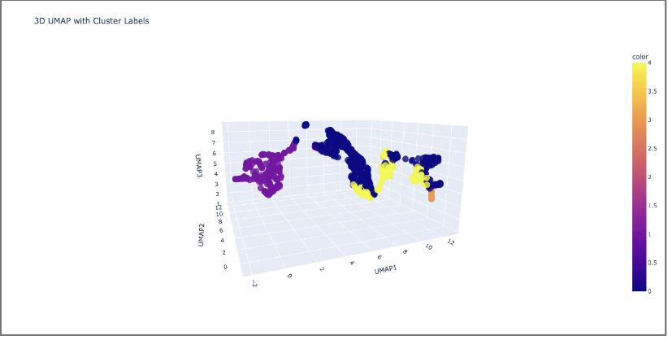

# 🌍 Exoplanet Habitability Clustering

This project is a machine learning-based exploration of exoplanet habitability. Conducted under the guidance of **Professor Downing**, it focuses on identifying exoplanets that may contain water and potentially support life. Using unsupervised learning techniques, the project analyzes real exoplanetary data from sources such as **NASA** and **Gaia**, clustering planets based on characteristics similar to those of Earth.

---

## 🚀 Overview

We developed a clustering pipeline using **K-Means** and **UMAP** dimensionality reduction to:

- Integrate and process real-world exoplanet datasets.
- Filter and normalize critical stellar and planetary features.
- Cluster planets using K-Means based on:
  - Stellar luminosity
  - Stellar radius
  - Stellar effective temperature
  - Orbital period
  - Semi-major axis
  - Orbital eccentricity
  - Planetary mass
- Visualize clustering results in 3D using **Plotly** and **UMAP**.
- Identify and compare planets in the same cluster as Earth.

---

## 🧠 Machine Learning Approach

- **Unsupervised Learning** with `KMeans` to group planets with similar characteristics.
- **Dimensionality Reduction** with `UMAP` to visualize high-dimensional data in 3D.
- **Standardization** with `StandardScaler` to ensure features are on the same scale.
- Included **Earth** manually in the dataset to serve as a reference point for habitability.

---

## 📊 Key Tools & Libraries

- Python
- pandas
- scikit-learn
- UMAP
- plotly

---

## 📁 Dataset

- Original dataset sourced from **NASA's Exoplanet Archive** (July 2023 version).
- Filtered for valid observations and controversial flags.
- Earth was appended manually for comparative clustering.

---

## 📈 Example Visualization



Clusters are color-coded and planets are labeled to show their similarity grouping.

---

## 🧪 Sample Output

```bash
Planet:  Kepler-1649 c 
     pl_name  st_lum  st_rad  ...  cluster_label
1234  Kepler-1649 c   0.004    0.21  ...       3
...
Planet:  Earth 
     pl_name  st_lum  st_rad  ...  cluster_label
9999     Earth   1.000    1.000  ...       3
